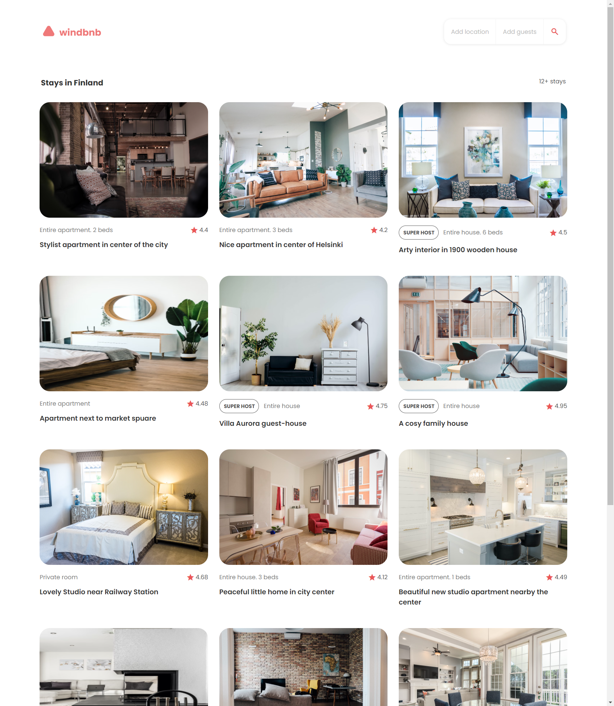

<h1 align="center">Button and Input component</h1>

<div align="center">
   Solution for a challenge from  <a href="http://devchallenges.io" target="_blank">Devchallenges.io</a>.
</div>

<div align="center">
  <h3>
    <a href="https://iamvishal345.github.io/windbnb-web/">
      Demo
    </a>
    <span> | </span>
    <a href="https://github.com/iamvishal345/windbnb-web/">
      Solution
    </a>
    <span> | </span>
    <a href="https://devchallenges.io/challenges/3JFYedSOZqAxYuOCNmYD">
      Challenge
    </a>
  </h3>
</div>

<!-- TABLE OF CONTENTS -->

## Table of Contents

- [Table of Contents](#table-of-contents)
- [Overview](#overview)
  - [Built With](#built-with)
- [Features](#features)
- [How To Use](#how-to-use)
- [Acknowledgements](#acknowledgements)
- [Contact](#contact)

<!-- OVERVIEW -->

## Overview



### Built With

- [React](https://reactjs.org/)

## Features

This application/site was created as a submission to a [DevChallenges](https://devchallenges.io/challenges) challenge. The [challenge](https://devchallenges.io/challenges/3JFYedSOZqAxYuOCNmYD) was to build an application to complete the given user stories.

## How To Use

To clone and run this application, you'll need [Git](https://git-scm.com) and [Node.js](https://nodejs.org/en/download/) (which comes with [npm](http://npmjs.com))
and [yarn](https://yarnpkg.com/) installed on your computer. From your command line:

```bash
# Clone this repository
$ git clone https://github.com/iamvishal345/windbnb-web.git

# Install dependencies
$ yarn

# Run the app
$ yarn dev
```

## Acknowledgements

- [Steps to replicate a design with only HTML and CSS](https://devchallenges-blogs.web.app/how-to-replicate-design/)
- [Node.js](https://nodejs.org/)
- [React](https://reactjs.org/)
- [Vite](https://vitejs.dev/)
- [Google Icons](https://fonts.google.com/icons)

## Contact

- Website [vishal.codeentity.tech](https://vishal.codeentity.tech/)
- Blog [codeentity.tech](https://codeentity.tech)
- GitHub [iamvishal345](https://github.com/iamvishal345)
